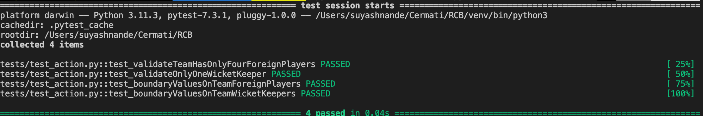

# RCB

## Step 1 : Install Latest Python

```bash
https://www.python.org/downloads/
```

## Step 2 : Check the installation

```bash
python --version
```

## Step 3 : Copy the repo into local

```bash
Open an editor (e.g. vscode)
mkdir RCB
cd RCB
git clone git@github.com:suyashnatural/RCB.git
```

## Step 4 : Create a virtual env

```bash
python3 -m venv venv
source venv/bin/activate
```

## Step 5 : Install pytest in the virtual env

```bash
python3 -m pip install pytest
```

## Step 6: Execute the test

```bash
pytest -v tests/test_action.py
```

## Step 7: On successful execution, below should be prompted


